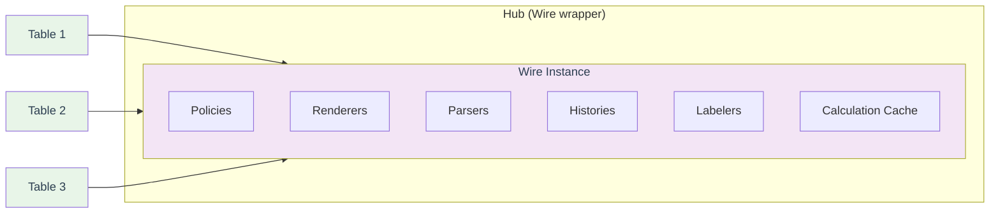
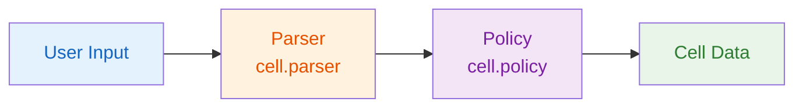
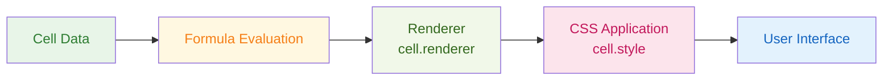
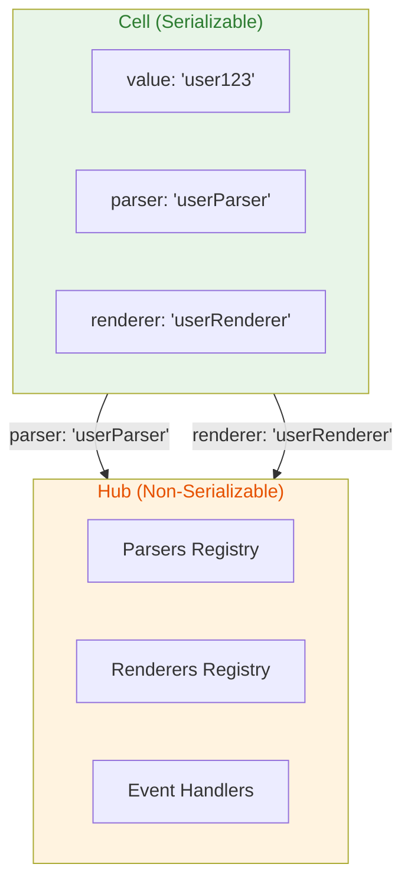

# Architecture & Design

This document provides an overview of GridSheet's architecture and design principles.

## Core Architecture

### Table and Hub Relationship

The most important architectural relationship in GridSheet is between the **Hub** and **Table** instances. The Hub serves as a cross-cutting access point for multiple Table instances, while each Table instance corresponds one-to-one with a sheet.



### Hub Architecture

The **Hub** is a cross-cutting instance that provides access to multiple Table instances. It contains:

- **Cross-cutting Configuration**: Policies, renderers, parsers, histories, and labelers
- **Cell Data**: Actual cell values, formulas, and metadata
- **Calculation Cache**: Cached formula results for performance

The Hub is actually a wrapper around the **Wire** class, which is the core implementation. This design allows React/Preact to trigger sheet re-renders by changing references, while the internal Wire instance maintains the same reference throughout its lifecycle.

> **Note**: Even when using only a single table, a Hub (Wire instance) is implicitly created to manage the cell data and configuration.

### Table Architecture

Each **Table** instance corresponds one-to-one with a sheet and contains:

- **ID Matrix**: Internal data identifiers that correspond to sheet row/column positions
- **Sheet State**: Current state of the specific sheet
- **UI State**: Visual state and rendering information

### Cell Reference System

GridSheet uses an internal ID-based reference system for formulas:

- **Internal References**: Formulas use IDs like `#f1`, `#f2` instead of addresses like `A1`
- **Address Mapping**: The system converts IDs to addresses for display
- **Stable References**: This ensures formulas don't break when rows/columns are added/removed

For example:
```tsx
// Internal formula storage
"=SUM(#2!#f1:#f5)"  // Uses internal IDs

// Display conversion
"=SUM('Sheet2'!A1:A5)"    // Converted to addresses for display
```

This architecture provides:
- **Stable References**: Formulas remain intact during structural changes
- **Performance**: ID-based lookups are faster than address parsing
- **Flexibility**: Easy to add/remove rows/columns without breaking formulas

## Data Flow

GridSheet processes data through two main flows: data input and data output. Each flow uses identifiers (strings) rather than instances for parsers and renderers to enable persistence.

### Data Input Flow

Data input follows this sequence: User Input → Parser → Policy



- **User Input**: Raw input from keyboard, paste, or programmatic updates
- **Parser**: Converts input to appropriate data type using `cell.parser` identifier
- **Policy**: Validates and processes data using `cell.policy` identifier
- **Cell Data**: Final processed data stored in the cell

### Data Output Flow

Data output follows this sequence: Cell Data → Formula Evaluation → Renderer → CSS Application



- **Cell Data**: Raw cell value or formula
- **Formula Evaluation**: Calculates formula results if present
- **Renderer**: Formats display using `cell.renderer` identifier
- **CSS Application**: Applies styling using `cell.style` properties
- **User Interface**: Final rendered cell in the grid

## Cell Value Serialization

GridSheet is designed with persistence in mind, ensuring that cell values are serializable and can be safely stored and restored. This design principle is crucial for maintaining data integrity across sessions and enabling features like undo/redo, data export, and state persistence.

### Serialization Design

Cell values are designed to be **serializable** and contain only **persistable data**. This means:

- **Serializable Values**: All cell values can be converted to JSON and back without loss
- **Persistable Data**: Values can be safely stored in databases, local storage, or transmitted over networks
- **Non-Serializable Objects**: Event handlers, class instances, and other non-serializable objects are not stored directly in cells

### Hub-Based Architecture for Non-Serializable Data

To handle non-serializable objects while maintaining cell serialization, GridSheet uses a **Hub-based architecture**:



### Multi-Sheet Event Handling

When multiple sheets share the same hub, event handlers receive a `table` parameter that contains the `UserTable` instance. You can use `table.sheetName` to identify which sheet triggered the event:

```tsx
const hub = useHub({
  onChange: ({ table, points }) => {
    // Use table.sheetName to identify the source sheet
    if (table.sheetName === 'Sales') {
      console.log('Sales sheet data changed:', points);
    } else if (table.sheetName === 'Inventory') {
      console.log('Inventory sheet data changed:', points);
    }
  },
  onRemoveRows: ({ table, ys }) => {
    console.log(`Rows removed from ${table.sheetName}:`, ys);
  },
  onKeyUp: ({ e, points }) => {
    console.log(`Key pressed: ${e.key} at position:`, points);
  },
  onInit: ({ table }) => {
    console.log(`Table initialized: ${table.sheetName}`);
  },
});
```

**Important**: Always use `table.sheetName` for conditional logic when multiple sheets share the same hub to ensure proper event handling and data management.

**How it works:**

1. **Cell Storage**: Cells store only serializable identifiers (strings) for parsers, renderers, and other components
2. **Hub Registry**: The Hub maintains registries of actual instances, event handlers, and class objects
3. **Identifier Resolution**: When needed, the system resolves identifiers to actual instances from the Hub
4. **Persistence**: Only the cell data (with identifiers) is persisted, while the Hub instances are recreated as needed

### Benefits of This Design

- **Data Integrity**: Cell data remains consistent and serializable
- **Flexibility**: Non-serializable objects can still be used through the Hub system
- **Performance**: Direct object references are maintained during runtime
- **Persistence**: Data can be safely saved and restored without losing functionality
- **Extensibility**: New parsers, renderers, and handlers can be added without breaking existing data

### Example Implementation

```tsx
// Cell stores only serializable data
const cell = {
  value: "user123",
  parser: "userParser",        // Identifier, not the actual parser instance
  renderer: "userRenderer",    // Identifier, not the actual renderer instance
  custom: { userId: 123 }      // Serializable custom data
}

// Hub stores the actual instances
const hub = {
  parsers: {
    userParser: new UserParser(),  // Actual parser instance
  },
  renderers: {
    userRenderer: new UserRenderer(),  // Actual renderer instance
  },
  eventHandlers: {
    userHandler: (event) => { /* handler logic */ }  // Event handler function
  }
}
```

This architecture ensures that GridSheet can handle complex, non-serializable objects while maintaining the ability to persist and restore cell data reliably.

## Matrix Data Evaluation

GridSheet uses a matrix-based data structure where each cell is identified by its row and column coordinates. The evaluation process considers both header information and cell data:

| Header Column & Header Row (0,0) | A Column Info (0,1) | B Column Info (0,2) |
|----------------------------------|---------------------|---------------------|
| 1st Row Info (1,0) | A1 Cell Info (1,1) | B1 Cell Info (1,2) |
| 2nd Row Info (2,0) | A2 Cell Info (2,1) | B2 Cell Info (2,2) |


## Component Hierarchy

GridSheet is composed of several key components that work together to provide the complete spreadsheet experience:

- **GridSheet**: Main container and orchestrator
  - **FormulaBar**: Displays and edits cell formulas
  - **SearchBar**: Provides search functionality across the grid
  - **Editor**: Handles cell editing and input validation
  - **Tabular**: Core grid rendering component
    - **HeaderCellLeft...**: Left-side row headers
    - **HeaderCellTop...**: Top-side column headers
    - **Cell...**: Individual cell components
  - **StoreObserver**: Monitors state changes and triggers updates
  - **ContextMenu**: Right-click context menu functionality
  - **Resizer**: Handles column/row resizing operations
