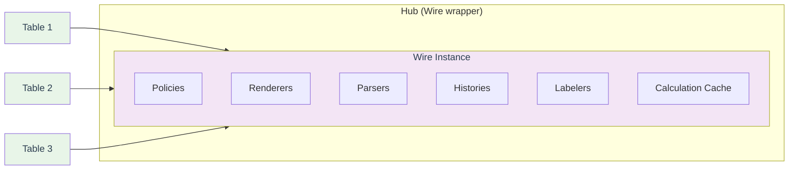
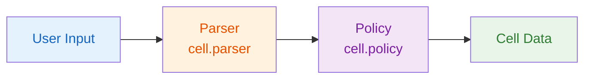
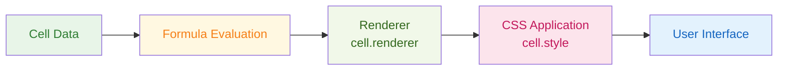
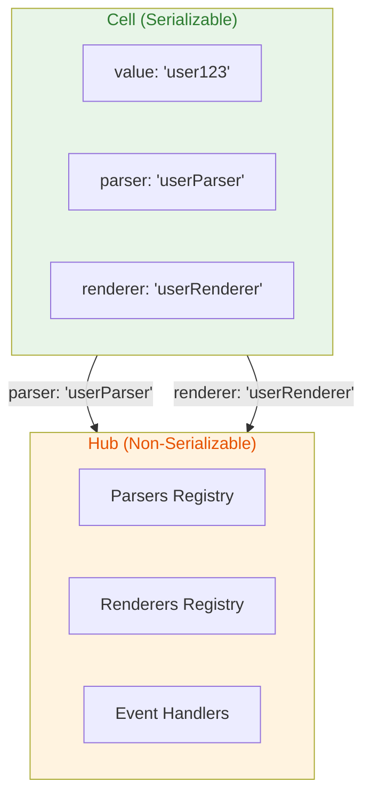
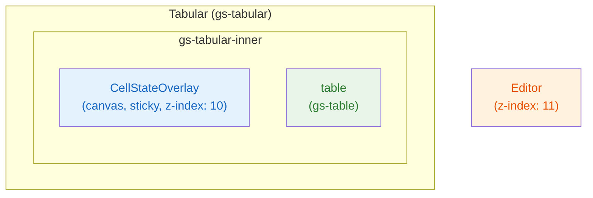

# Architecture & Design

This document provides an overview of GridSheet's architecture and design principles.

## Core Architecture

### Table and Hub Relationship

The most important architectural relationship in GridSheet is between the **Hub** and **Table** instances. The Hub serves as a cross-cutting access point for multiple Table instances, while each Table instance corresponds one-to-one with a sheet.



### Hub Architecture

The **Hub** is a cross-cutting instance that provides access to multiple Table instances. It contains:

- **Cross-cutting Configuration**: Policies, renderers, parsers, histories, and labelers
- **Cell Data**: Actual cell values, formulas, and metadata
- **Calculation Cache**: Cached formula results for performance

The Hub is actually a wrapper around the **Wire** class, which is the core implementation. This design allows React/Preact to trigger sheet re-renders by changing references, while the internal Wire instance maintains the same reference throughout its lifecycle.

> **Note**: Even when using only a single table, a Hub (Wire instance) is implicitly created to manage the cell data and configuration.

### Table Architecture

Each **Table** instance corresponds one-to-one with a sheet and contains:

- **ID Matrix**: Internal data identifiers that correspond to sheet row/column positions
- **Sheet State**: Current state of the specific sheet
- **UI State**: Visual state and rendering information

### Cell Reference System

GridSheet uses an internal ID-based reference system for formulas:

- **Internal References**: Formulas use IDs like `#f1`, `#f2` instead of addresses like `A1`
- **Address Mapping**: The system converts IDs to addresses for display
- **Stable References**: This ensures formulas don't break when rows/columns are added/removed

For example:
```tsx
// Internal formula storage
"=SUM(#2!#f1:#f5)"  // Uses internal IDs

// Display conversion
"=SUM('Sheet2'!A1:A5)"    // Converted to addresses for display
```

This architecture provides:
- **Stable References**: Formulas remain intact during structural changes
- **Performance**: ID-based lookups are faster than address parsing
- **Flexibility**: Easy to add/remove rows/columns without breaking formulas

## Data Flow

GridSheet processes data through two main flows: data input and data output. Each flow uses identifiers (strings) rather than instances for parsers and renderers to enable persistence.

### Data Input Flow

Data input follows this sequence: User Input → Parser → Policy



- **User Input**: Raw input from keyboard, paste, or programmatic updates
- **Parser**: Converts input to appropriate data type using `cell.parser` identifier
- **Policy**: Validates and processes data using `cell.policy` identifier
- **Cell Data**: Final processed data stored in the cell

### Data Output Flow

Data output follows this sequence: Cell Data → Formula Evaluation → Renderer → CSS Application



- **Cell Data**: Raw cell value or formula
- **Formula Evaluation**: Calculates formula results if present
- **Renderer**: Formats display using `cell.renderer` identifier
- **CSS Application**: Applies styling using `cell.style` properties
- **User Interface**: Final rendered cell in the grid

## Cell Value Serialization

GridSheet is designed with persistence in mind, ensuring that cell values are serializable and can be safely stored and restored. This design principle is crucial for maintaining data integrity across sessions and enabling features like undo/redo, data export, and state persistence.

### Serialization Design

Cell values are designed to be **serializable** and contain only **persistable data**. This means:

- **Serializable Values**: All cell values can be converted to JSON and back without loss
- **Persistable Data**: Values can be safely stored in databases, local storage, or transmitted over networks
- **Non-Serializable Objects**: Event handlers, class instances, and other non-serializable objects are not stored directly in cells

### Hub-Based Architecture for Non-Serializable Data

To handle non-serializable objects while maintaining cell serialization, GridSheet uses a **Hub-based architecture**:



### Multi-Sheet Event Handling

When multiple sheets share the same hub, event handlers receive a `table` parameter that contains the `UserTable` instance. You can use `table.sheetName` to identify which sheet triggered the event:

```tsx
const hub = useHub({
  onChange: ({ table, points }) => {
    // Use table.sheetName to identify the source sheet
    if (table.sheetName === 'Sales') {
      console.log('Sales sheet data changed:', points);
    } else if (table.sheetName === 'Inventory') {
      console.log('Inventory sheet data changed:', points);
    }
  },
  onRemoveRows: ({ table, ys }) => {
    console.log(`Rows removed from ${table.sheetName}:`, ys);
  },
  onKeyUp: ({ e, points }) => {
    console.log(`Key pressed: ${e.key} at position:`, points);
  },
  onInit: ({ table }) => {
    console.log(`Table initialized: ${table.sheetName}`);
  },
});
```

**Important**: Always use `table.sheetName` for conditional logic when multiple sheets share the same hub to ensure proper event handling and data management.

**How it works:**

1. **Cell Storage**: Cells store only serializable identifiers (strings) for parsers, renderers, and other components
2. **Hub Registry**: The Hub maintains registries of actual instances, event handlers, and class objects
3. **Identifier Resolution**: When needed, the system resolves identifiers to actual instances from the Hub
4. **Persistence**: Only the cell data (with identifiers) is persisted, while the Hub instances are recreated as needed

### Benefits of This Design

- **Data Integrity**: Cell data remains consistent and serializable
- **Flexibility**: Non-serializable objects can still be used through the Hub system
- **Performance**: Direct object references are maintained during runtime
- **Persistence**: Data can be safely saved and restored without losing functionality
- **Extensibility**: New parsers, renderers, and handlers can be added without breaking existing data

### Example Implementation

```tsx
// Cell stores only serializable data
const cell = {
  value: "user123",
  parser: "userParser",        // Identifier, not the actual parser instance
  renderer: "userRenderer",    // Identifier, not the actual renderer instance
  custom: { userId: 123 }      // Serializable custom data
}

// Hub stores the actual instances
const hub = {
  parsers: {
    userParser: new UserParser(),  // Actual parser instance
  },
  renderers: {
    userRenderer: new UserRenderer(),  // Actual renderer instance
  },
  eventHandlers: {
    userHandler: (event) => { /* handler logic */ }  // Event handler function
  }
}
```

This architecture ensures that GridSheet can handle complex, non-serializable objects while maintaining the ability to persist and restore cell data reliably.

## Matrix Data Evaluation

GridSheet uses a matrix-based data structure where each cell is identified by its row and column coordinates. The evaluation process considers both header information and cell data:

| Header Column & Header Row (0,0) | A Column Info (0,1) | B Column Info (0,2) |
|----------------------------------|---------------------|---------------------|
| 1st Row Info (1,0) | A1 Cell Info (1,1) | B1 Cell Info (1,2) |
| 2nd Row Info (2,0) | A2 Cell Info (2,1) | B2 Cell Info (2,2) |

## Async Formula Caching

GridSheet provides built-in caching for asynchronous formulas to improve performance and reduce redundant API calls.

### Cache Storage

Async formula results are cached per-cell with the following structure:

```typescript
cell.asyncCache = {
  value: any,              // The cached result (or error)
  key: string,             // Cache key based on function name + arguments
  expireTime?: number      // Optional expiration timestamp (ms since epoch)
}
```

The cache key is generated using:
- **Function name**: Identifies which async formula is being called
- **Serialized arguments**: Includes cell values, tables as matrices, etc.
- **Hash**: cyrb53 hash of the serialized arguments for collision detection

```typescript
// Example: GH_REPO("facebook/react", "stars")
// Cache key: "GH_REPO:45:2gosa7pa2gv"
//            funcName:length:base36-hash(up to 11 chars)
```

### In-Flight Promise Tracking

While an async formula is being evaluated, GridSheet tracks pending promises per-cell:

```typescript
// In Wire instance
wire.asyncPending.set(cellId, pendingValue);
```

This prevents duplicate requests when the same cell is evaluated multiple times during a single render cycle.

### Cache Invalidation

Caches are invalidated in the following scenarios:

1. **Input Changed**: When formula arguments change, the cache key changes and a new fetch is triggered
2. **Expired**: When the TTL (specified by `ttlMilliseconds`) expires, the cache is discarded
3. **Dependent Updates**: When upstream cells change, dependent formulas are re-evaluated

### TTL Configuration

Set cache TTL in your async formula class:

```typescript
class MyAsyncFunction extends BaseFunction {
  // Cache for 1 minute
  ttlMilliseconds = 60 * 1000;

  async main(...args: any[]) {
    // Async logic
  }
}
```

## Filtering & Sorting with Async Formulas

GridSheet stores filtering information in the header cells using special methods:

### Filter Information Storage

- **Filter Conditions**: Stored in column header cells `(0, x)` via `cell.filter()`
  - Contains the filter predicate and configuration for that column
  - Used to determine which rows should be visible

- **Filtered Row Tracking**: Stored in row header cells `(y, 0)` via `cell.filtered()`
  - Indicates whether a row passes all active filters
  - `true` = row is visible, `false` = row is hidden by filter

```typescript
// Column header (0, x) stores filter condition
columnHeaderCell.filter()  // Returns filter config for column x

// Row header (y, 0) tracks if row is visible
rowHeaderCell.filtered()   // Returns true if row passes filters, false if hidden
```

### Filter Behavior

When filtering data that contains async formulas:

1. **Async Evaluation**: All cells in the filter scope are evaluated
2. **Wait for Completion**: GridSheet waits for all pending async operations to complete
3. **Filter Application**: Once all values are resolved, the filter predicate is applied
4. **Update Headers**: 
   - Column header `(0, x)` is updated with the new filter configuration
   - Row headers `(y, 0)` are updated with visibility status
5. **Error Handling**: If an async formula throws, the cell displays an error value which is treated as a falsy value for filtering

```typescript
// If an async formula returns an error, it's stored in cell.asyncCache
cell.asyncCache = {
  value: new FormulaError('#ASYNC!', 'Network error'),
  key: 'GH_REPO:45:2847391048',
  expireTime: 1708847391048
}

// Error values are falsy in filter predicates
```

### Sort Behavior

Sorting works similarly to filtering:

1. **Async Evaluation**: All cells in the sort scope are evaluated
2. **Wait for Completion**: GridSheet waits for all pending async operations
3. **Sort Application**: Resolved values are sorted according to the sort comparator
4. **Deterministic Ordering**: Cells with the same resolved value maintain their original order (stable sort)

### Performance Considerations

- **Caching**: Results are cached with the configured TTL, reducing API calls during repeated filter/sort operations
- **Parallel Evaluation**: Multiple async formulas in the same column are fetched in parallel via Promise.all
- **UI Responsiveness**: A loading indicator is shown during the wait period, maintaining a responsive UX
- **Error Resilience**: Filter/sort operations continue even if individual async formulas fail

## Component Hierarchy

GridSheet is composed of several key components that work together to provide the complete spreadsheet experience:

- **GridSheet**: Main container and orchestrator
  - **FormulaBar**: Displays and edits cell formulas
  - **SearchBar**: Provides search functionality across the grid
  - **Editor**: Handles cell editing and input validation
  - **Tabular**: Core grid rendering component
    - **CellStateOverlay**: Canvas-based overlay for selection visuals
    - **HeaderCellLeft...**: Left-side row headers
    - **HeaderCellTop...**: Top-side column headers
    - **Cell...**: Individual cell components
  - **StoreObserver**: Monitors state changes and triggers updates
  - **ContextMenu**: Right-click context menu functionality
  - **Resizer**: Handles column/row resizing operations

## Canvas Overlay (CellStateOverlay)

Selection visuals (choosing border, selecting range, copy/cut dashed border, autofill, formula references, search highlights, and header highlights) are rendered on a single `<canvas>` element instead of applying per-cell inline styles. This architecture prevents memory leaks caused by mounting style objects on every individual cell component.

### Why Canvas?

In the previous approach, each cell received an `operationStyle` prop containing selection-related CSS (background color, border). This caused:

- **Memory leaks**: Style objects were created for every cell in the selection range on each state change
- **Excessive re-renders**: Changing selection triggered re-renders across all affected cells
- **DOM overhead**: Hundreds or thousands of DOM style mutations per selection change

The canvas overlay draws all selection visuals in a single paint operation, independent of the number of cells involved.

### Rendering Architecture



- The canvas is placed inside a **sticky wrapper** (`position: sticky; top: 0; left: 0; width: 0; height: 0; overflow: visible`) so it stays fixed relative to the viewport while scrolling
- The canvas is **viewport-sized** (matches `gs-tabular` client dimensions), not full-table-sized, to avoid canvas size limits on large tables
- The **Editor** has `z-index: 11`, above the overlay's `z-index: 10`, ensuring the editing input is always interactive

### Drawing Layers

The canvas draws 7 layers in order:

1. **Selecting zone** — fill + border for the current selection range (clipped to cell area, excluding headers)
2. **Autofill dragging** — dashed border for autofill drag preview
3. **Choosing cell** — solid border around the currently pointed cell
4. **Copy/Cut zone** — dashed border for the clipboard range
5. **Formula references** — colored borders for formula cell references (using the color palette)
6. **Search matches** — highlighted background for search results
7. **Header highlights** — semi-transparent fills on top/left headers (drawn outside the cell-area clip region)

Layers 1–6 are drawn within a clip region (`ctx.clip()`) that excludes the sticky header area, so cell selections don't bleed into headers. Layer 7 is drawn after restoring the full canvas to overlay the header region.

### Coordinate System

Cell positions are resolved via `System.offsetTop` / `System.offsetLeft` metadata stored on header cells. This provides **O(1) coordinate lookup** instead of iterating over rows/columns:

- `System.offsetTop` on row header cells (`y, x=0`) stores the cumulative top offset
- `System.offsetLeft` on column header cells (`y=0, x`) stores the cumulative left offset
- These offsets are computed once in `setTotalSize()` during table initialization

Drawing coordinates are converted from absolute table coordinates to viewport coordinates by subtracting `scrollTop` / `scrollLeft`.

### Scroll Synchronization

The overlay listens to the `scroll` event on `gs-tabular` and redraws **synchronously** (not via `requestAnimationFrame`) to avoid 1-frame lag between scroll position and overlay rendering. State-driven redraws (e.g., selection changes) use `requestAnimationFrame` for batching.

### CSS Classes vs Canvas

Cell and header elements still retain their CSS classes (`gs-choosing`, `gs-selecting`, `gs-th-selecting`) for:

- **E2E test selectors**: Tests query these classes to verify selection state
- **Non-visual styling**: e.g., `gs-selecting .gs-cell-label { display: block }` to show address labels in the selection range

Only the **background-color** styling for selection states has been moved to the canvas. The classes remain on the DOM elements.
