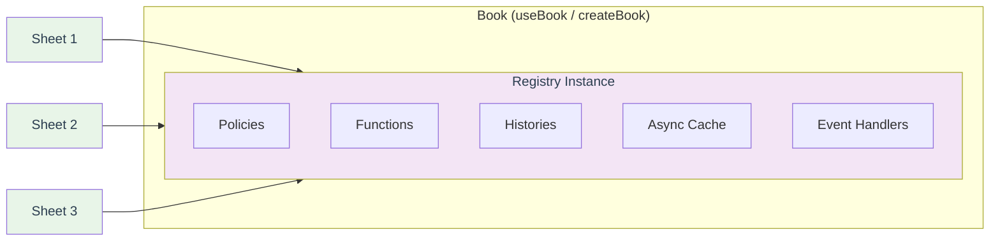
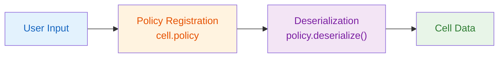
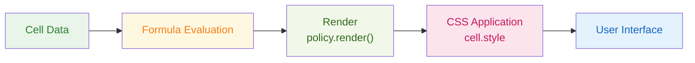
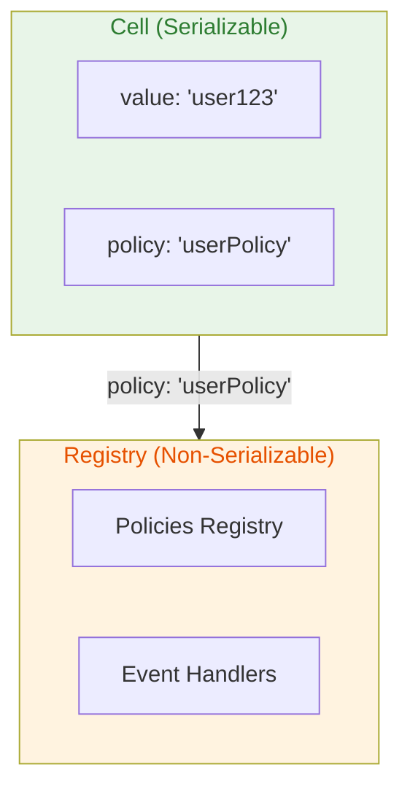
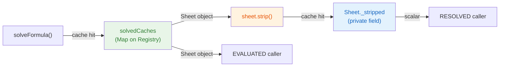
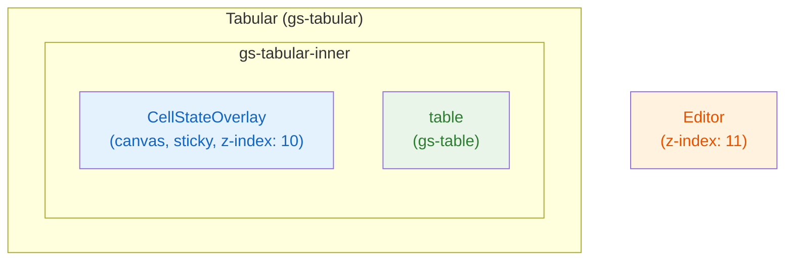

# Architecture & Design

This document provides an overview of GridSheet's architecture and design principles.

## Core Architecture

### Registry and Sheet Relationship

The most important architectural relationship in GridSheet is between the **Registry** and **Sheet** instances. The Registry serves as a cross-cutting access point for multiple Sheet instances, while each Sheet instance corresponds one-to-one with a rendered `<GridSheet>` component.


```mermaid
graph LR
    subgraph BOOK ["Book (useBook / createBook)"]
        subgraph REG["Registry Instance"]
            P["Policies"]
            FN["Functions"]
            HIST["Histories"]
            CACHE["Async Cache"]
            EV["Event Handlers"]
        end
    end
    
    T1["Sheet 1"]
    T2["Sheet 2"]
    T3["Sheet 3"]
    
    T1 --> REG
    T2 --> REG
    T3 --> REG
    
    style REG fill:#f3e5f5,color:#2c3e50
    style T1 fill:#e8f5e8,color:#2c3e50
    style T2 fill:#e8f5e8,color:#2c3e50
    style T3 fill:#e8f5e8,color:#2c3e50
```

### Registry Architecture

The **Registry** (accessed via a `Book`) is a cross-cutting instance shared across multiple sheets. It contains:

- **Function Registry**: Built-in and custom formula functions
- **Policy Registry**: Named cell policies (which handle both parsing and rendering)
- **History**: Undo/redo stack
- **Async Cache**: In-flight and completed async formula results
- **Event Handlers**: `onChange`, `onSave`, `onInit`, `onKeyUp`, etc.

A `Book` is a thin wrapper `{ registry: Registry }` created by `useBook()` (React hook) or `createBook()` (imperative). This wrapper pattern allows React to trigger re-renders by replacing the `Book` reference while the inner `Registry` object maintains stable identity.

> **Note**: Even when using only a single sheet, a `Registry` is implicitly created by the `<GridSheet>` component. Pass an explicit `book` prop to share a single Registry across multiple sheets.

### Sheet Architecture

Each **Sheet** instance corresponds one-to-one with a rendered `<GridSheet>` component and contains:

- **ID Matrix**: Internal data identifiers that correspond to sheet row/column positions
- **Cell Data**: The actual cell data keyed by cell ID, shared via the Registry
- **System Metadata**: Offset positions, sizes, and rendering metadata per cell
- **Sheet State**: Name, dimensions, limits, and formula resolution state

### Cell Reference System

GridSheet uses an internal ID-based reference system for formulas:

- **Internal References**: Formulas use IDs like `#f1`, `#f2` instead of addresses like `A1`
- **Address Mapping**: The system converts IDs to addresses for display
- **Stable References**: This ensures formulas don't break when rows/columns are added/removed

For example:
```tsx
// Internal formula storage
"=SUM(#2!#f1:#f5)"  // Uses internal IDs

// Display conversion
"=SUM('Sheet2'!A1:A5)"    // Converted to addresses for display
```

This architecture provides:
- **Stable References**: Formulas remain intact during structural changes
- **Performance**: ID-based lookups are faster than address parsing
- **Flexibility**: Easy to add/remove rows/columns without breaking formulas

## Data Flow

GridSheet processes data through two main flows: data input and data output. Each flow uses identifiers (strings) for policies to enable persistence.

### Data Input Flow

Data input follows this sequence: User Input → Policy Registration → Policy Deserialization


```mermaid
graph LR
    UI["User Input"] --> POL_REG["Policy Registration<br/>cell.policy"]
    POL_REG --> DESERIALIZE["Deserialization<br/>policy.deserialize()"]
    DESERIALIZE --> CD["Cell Data"]
    
    style UI fill:#e3f2fd,color:#1565c0
    style POL_REG fill:#fff3e0,color:#e65100
    style DESERIALIZE fill:#f3e5f5,color:#7b1fa2
    style CD fill:#e8f5e8,color:#2e7d32
```

- **User Input**: Raw input from keyboard, paste, or programmatic updates
- **Policy Registration**: Looks up the active policy instance using the `cell.policy` identifier
- **Deserialization**: Converts input string/data to appropriate data type using `policy.deserialize()`
- **Cell Data**: Final processed data stored in the cell

### Data Output Flow

Data output follows this sequence: Cell Data → Formula Evaluation → Policy Render → CSS Application


```mermaid
graph LR
    CD["Cell Data"] --> FE["Formula Evaluation"]
    FE --> RENDER["Render<br/>policy.render()"]
    RENDER --> CSS["CSS Application<br/>cell.style"]
    CSS --> UI["User Interface"]
    
    style CD fill:#e8f5e8,color:#2e7d32
    style FE fill:#fff8e1,color:#f57f17
    style RENDER fill:#f1f8e9,color:#33691e
    style CSS fill:#fce4ec,color:#c2185b
    style UI fill:#e3f2fd,color:#1565c0
```

- **Cell Data**: Raw cell value or formula
- **Formula Evaluation**: Calculates formula results if present
- **Policy Render**: Formats display using the `policy.render()` method from the `cell.policy` identifier
- **CSS Application**: Applies styling using `cell.style` properties
- **User Interface**: Final rendered cell in the grid

## Cell Value Serialization

GridSheet is designed with persistence in mind, ensuring that cell values are serializable and can be safely stored and restored. This design principle is crucial for maintaining data integrity across sessions and enabling features like undo/redo, data export, and state persistence.

### Serialization Design

Cell values are designed to be **serializable** and contain only **persistable data**. This means:

- **Serializable Values**: All cell values can be converted to JSON and back without loss
- **Persistable Data**: Values can be safely stored in databases, local storage, or transmitted over networks
- **Non-Serializable Objects**: Event handlers, class instances, and other non-serializable objects are not stored directly in cells

### Hub-Based Architecture for Non-Serializable Data

To handle non-serializable objects while maintaining cell serialization, GridSheet uses a **Hub-based architecture**:


```mermaid
graph TB
    subgraph CELL ["Cell (Serializable)"]
        V["value: 'user123'"]
        P["policy: 'userPolicy'"]
    end
    
    subgraph REGISTRY ["Registry (Non-Serializable)"]
        POLICIES["Policies Registry"]
        HANDLERS["Event Handlers"]
    end
    
    CELL -->|"policy: 'userPolicy'"| REGISTRY
    
    style CELL fill:#e8f5e8,color:#2e7d32
    style REGISTRY fill:#fff3e0,color:#e65100
```

### Multi-Sheet Event Handling

When multiple sheets share the same registry (via a shared `book`), event handlers receive a `sheet` parameter that is a `UserSheet` instance. Use `sheet.name` to identify which sheet triggered the event:

```tsx
const book = useBook({
  onChange: ({ sheet, points }) => {
    // Use sheet.name to identify the source sheet
    if (sheet.name === 'Sales') {
      console.log('Sales sheet data changed:', points);
    } else if (sheet.name === 'Inventory') {
      console.log('Inventory sheet data changed:', points);
    }
  },
  onRemoveRows: ({ sheet, ys }) => {
    console.log(`Rows removed from ${sheet.name}:`, ys);
  },
  onKeyUp: ({ e, points }) => {
    console.log(`Key pressed: ${e.key} at position:`, points);
  },
  onInit: ({ sheet }) => {
    console.log(`Sheet initialized: ${sheet.name}`);
  },
});

// Pass the same book to multiple GridSheet components
<GridSheet sheetName="Sales" book={book} ... />
<GridSheet sheetName="Inventory" book={book} ... />
```

**Important**: Always use `sheet.name` for conditional logic when multiple sheets share the same book to ensure proper event handling and data management.

**How it works:**

1. **Cell Storage**: Cells store only serializable identifiers (strings) for policies, formats, and other components
2. **Registry**: The Registry maintains instantiated objects, event handlers, and class objects
3. **Identifier Resolution**: When needed, the system resolves identifiers to actual instances from the Registry
4. **Persistence**: Only the cell data (with identifiers) is persisted, while the Registry instances are configured per-app

### Benefits of This Design

- **Data Integrity**: Cell data remains consistent and serializable
- **Flexibility**: Non-serializable objects can still be used through the Hub system
- **Performance**: Direct object references are maintained during runtime
- **Persistence**: Data can be safely saved and restored without losing functionality
- **Extensibility**: New policies and handlers can be added without breaking existing data

### Example Implementation

```tsx
// Cell stores only serializable data
const cell = {
  value: "user123",
  policy: "userPolicy",        // Identifier, not the actual policy instance
  custom: { userId: 123 }      // Serializable custom data
}

// Registry (book.registry) stores the actual instances
const book = useBook({
  policies: {
    userPolicy: new UserPolicy(),    // Actual policy instance (handles parsing + rendering)
  },
  additionalFunctions: {
    MY_FUNC: MyFunction,             // Formula function class
  },
  onChange: ({ sheet }) => { /* event handler */ },
});
```

This architecture ensures that GridSheet can handle complex, non-serializable objects while maintaining the ability to persist and restore cell data reliably.

## Formula Resolution and Caching

### Resolution Modes

`solveFormula` supports multiple resolution modes that control how formula results are returned:

- **`RESOLVED`**: Unwraps Sheet objects to scalar values (top-left cell). Used by `getCell()` for display and by `getSerializedValue()` for clipboard.
- **`EVALUATED`**: Keeps Sheet objects intact. Used by the render path when custom policies (e.g., sparkline) need access to the full range result.
- **`RAW`**: Returns the formula string with addresses resolved for display, without evaluating.
- **`SYSTEM`**: Returns the raw internal formula string as-is.

### Two-Layer Cache Architecture

GridSheet uses a two-layer caching strategy to efficiently serve both `RESOLVED` and `EVALUATED` callers without redundant computation:


```mermaid
graph LR
    SF["solveFormula()"] -->|cache hit| SC["solvedCaches\n(Map on Registry)"]
    SC -->|Sheet object| STRIP["sheet.strip()"]
    STRIP -->|cache hit| ST["Sheet._stripped\n(private field)"]
    ST -->|scalar| CALLER["RESOLVED caller"]
    SC -->|Sheet object| EVAL["EVALUATED caller"]

    style SC fill:#e8f5e8,color:#2e7d32
    style ST fill:#e3f2fd,color:#1565c0
    style STRIP fill:#fff3e0,color:#e65100
```

**Layer 1 — `solvedCaches` (Registry-level Map)**

Stores the raw evaluation result keyed by cell ID. For range formulas like `=C1:H1`, this is a `Sheet` object. The cache is written **before** any RESOLVED unwrapping, so it always retains the Sheet.

**Layer 2 — `Sheet._stripped` (instance-level field)**

Each Sheet instance caches its stripped scalar result. When `strip()` is called, it checks `_stripped` first. If it's `NONE` (a sentinel meaning "not yet stripped"), it evaluates via `solveSheet` and stores the result. Subsequent calls return the cached value in O(1).

### Why Two Layers?

**Background**: Originally, `solveFormula` cached the final result regardless of resolution mode. When called with `RESOLVED`, it would strip a Sheet to a scalar and cache that scalar. This caused a bug: if a cell's formula produced a Sheet (e.g., `=C1:H1` for a sparkline), a `RESOLVED` caller (such as clipboard serialization) would overwrite the cached Sheet with a scalar. Subsequent `EVALUATED` callers (such as the render path with a sparkline policy) would then receive the scalar instead of the Sheet, breaking the rendering.

Preserving the Sheet object in the cache is essential for GridSheet's expressiveness. Custom policies like sparklines rely on receiving the full range result (a Sheet) to render complex visualizations from multiple cell values. If the cache only stored scalars, these multi-value views would be impossible — every formula result would be reduced to a single number, losing the range information that makes rich cell rendering possible.

**Solution**: The cache write was moved **before** the RESOLVED strip step, so `solvedCaches` always stores the Sheet. The strip result is cached separately on the Sheet instance itself (`_stripped`), giving RESOLVED callers O(1) access without polluting the shared cache.

### Cache Lifecycle

- `solvedCaches` is cleared in `clearSolvedCaches()` during `refresh()`, which runs on every state change (edit, undo, structural change).
- When `solvedCaches` is cleared, all Sheet references are released, and their `_stripped` values are garbage-collected along with them.
- `Sheet._stripped` is reset to `NONE` in `trim()`, `clone()`, and `refresh()` as a defensive measure.
- Both layers are populated lazily on first access and remain valid for the duration of a render cycle.

### Performance Characteristics

For a RESOLVED call on a cached formula:

1. `solveFormula` → `solvedCaches.get(id)` → **O(1)** (returns Sheet)
2. `stripSheet` → `sheet.strip()` → `_stripped` check → **O(1)** (returns cached scalar)

No formula re-parsing, no REF chain traversal, no `solveSheet` invocation. Two Map/field lookups total.

## Matrix Data Evaluation

GridSheet uses a matrix-based data structure where each cell is identified by its row and column coordinates. The evaluation process considers both header information and cell data:

| Header Column & Header Row (0,0) | A Column Info (0,1) | B Column Info (0,2) |
|----------------------------------|---------------------|---------------------|
| 1st Row Info (1,0) | A1 Cell Info (1,1) | B1 Cell Info (1,2) |
| 2nd Row Info (2,0) | A2 Cell Info (2,1) | B2 Cell Info (2,2) |

## Async Formula Caching

GridSheet provides built-in caching for asynchronous formulas to improve performance and reduce redundant API calls.

### Cache Storage

Async formula results are cached per-cell with the following structure:

```typescript
cell.asyncCache = {
  value: any,              // The cached result (or error)
  key: string,             // Cache key based on function name + arguments
  expireTime?: number      // Optional expiration timestamp (ms since epoch)
}
```

The cache key is generated using:
- **Function name**: Identifies which async formula is being called
- **Serialized arguments**: Includes cell values, tables as matrices, etc.
- **Hash**: cyrb53 hash of the serialized arguments for collision detection

```typescript
// Example: GH_REPO("facebook/react", "stars")
// Cache key: "GH_REPO:45:2gosa7pa2gv"
//            funcName:length:base36-hash(up to 11 chars)
```

### In-Flight Promise Tracking

While an async formula is being evaluated, GridSheet tracks pending promises per-cell:

```typescript
// In Wire instance
wire.asyncPending.set(cellId, pendingValue);
```

This prevents duplicate requests when the same cell is evaluated multiple times during a single render cycle.

### Cache Invalidation

Caches are invalidated in the following scenarios:

1. **Input Changed**: When formula arguments change, the cache key changes and a new fetch is triggered
2. **Expired**: When the TTL (specified by `ttlMilliseconds`) expires, the cache is discarded
3. **Dependent Updates**: When upstream cells change, dependent formulas are re-evaluated

### TTL Configuration

Set cache TTL in your async formula class:

```typescript
class MyAsyncFunction extends BaseFunctionAsync {
  // Cache for 1 minute
  ttlMilliseconds = 60 * 1000;

  async main(...args: any[]) {
    // Async logic
  }
}
```

## Filtering & Sorting with Async Formulas

GridSheet stores filtering information in the header cells using special methods:

### Filter Information Storage

- **Filter Conditions**: Stored in column header cells `(0, x)` via `cell.filter()`
  - Contains the filter predicate and configuration for that column
  - Used to determine which rows should be visible

- **Filtered Row Tracking**: Stored in row header cells `(y, 0)` via `cell.filtered()`
  - Indicates whether a row passes all active filters
  - `true` = row is visible, `false` = row is hidden by filter

```typescript
// Column header (0, x) stores filter condition
columnHeaderCell.filter()  // Returns filter config for column x

// Row header (y, 0) tracks if row is visible
rowHeaderCell.filtered()   // Returns true if row passes filters, false if hidden
```

### Filter Behavior

When filtering data that contains async formulas:

1. **Async Evaluation**: All cells in the filter scope are evaluated
2. **Wait for Completion**: GridSheet waits for all pending async operations to complete
3. **Filter Application**: Once all values are resolved, the filter predicate is applied
4. **Update Headers**: 
   - Column header `(0, x)` is updated with the new filter configuration
   - Row headers `(y, 0)` are updated with visibility status
5. **Error Handling**: If an async formula throws, the cell displays an error value which is treated as a falsy value for filtering

```typescript
// If an async formula returns an error, it's stored in cell.asyncCache
cell.asyncCache = {
  value: new FormulaError('#ASYNC!', 'Network error'),
  key: 'GH_REPO:45:2847391048',
  expireTime: 1708847391048
}

// Error values are falsy in filter predicates
```

### Sort Behavior

Sorting works similarly to filtering:

1. **Async Evaluation**: All cells in the sort scope are evaluated
2. **Wait for Completion**: GridSheet waits for all pending async operations
3. **Sort Application**: Resolved values are sorted according to the sort comparator
4. **Deterministic Ordering**: Cells with the same resolved value maintain their original order (stable sort)

### Performance Considerations

- **Caching**: Results are cached with the configured TTL, reducing API calls during repeated filter/sort operations
- **Parallel Evaluation**: Multiple async formulas in the same column are fetched in parallel via Promise.all
- **UI Responsiveness**: A loading indicator is shown during the wait period, maintaining a responsive UX
- **Error Resilience**: Filter/sort operations continue even if individual async formulas fail

## Component Hierarchy

GridSheet is composed of several key components that work together to provide the complete spreadsheet experience:

- **GridSheet**: Main container and orchestrator
  - **FormulaBar**: Displays and edits cell formulas; contains **FunctionGuide** for autocomplete help
  - **SearchBar**: Provides search/replace functionality across the grid (shown instead of FormulaBar)
  - **Editor**: Handles cell editing and input validation
  - **Tabular**: Core grid rendering component
    - **CellStateOverlay**: Canvas-based overlay for selection visuals
    - **HeaderCellLeft**: Left-side row headers
    - **HeaderCellTop**: Top-side column headers
    - **Cell**: Individual cell components
  - **StoreObserver**: Monitors state changes and triggers `onChange`, `onSave`, etc.
  - **ContextMenu**: Right-click context menu
  - **ColumnMenu**: Column header click menu (filter/sort/label)
  - **RowMenu**: Row header click menu
  - **Resizer**: Handles column/row resizing via drag
  - **ScrollHandle**: Invisible scroll triggers at edges (for autoscroll during drag/select)
  - **Emitter**: Broadcasts keyboard/focus events to the parent

## Canvas Overlay (CellStateOverlay)

Selection visuals (choosing border, selecting range, copy/cut dashed border, autofill, formula references, search highlights, and header highlights) are rendered on a single `<canvas>` element instead of applying per-cell inline styles. This architecture prevents memory leaks caused by mounting style objects on every individual cell component.

### Why Canvas?

In the previous approach, each cell received an `operationStyle` prop containing selection-related CSS (background color, border). This caused:

- **Memory leaks**: Style objects were created for every cell in the selection range on each state change
- **Excessive re-renders**: Changing selection triggered re-renders across all affected cells
- **DOM overhead**: Hundreds or thousands of DOM style mutations per selection change

The canvas overlay draws all selection visuals in a single paint operation, independent of the number of cells involved.

### Rendering Architecture


```mermaid
graph TB
    subgraph TABULAR ["Tabular (gs-tabular)"]
        subgraph INNER ["gs-tabular-inner"]
            CANVAS["CellStateOverlay<br/>(canvas, sticky, z-index: 10)"]
            TABLE["table<br/>(gs-table)"]
        end
    end

    EDITOR["Editor<br/>(z-index: 11)"]

    style CANVAS fill:#e3f2fd,color:#1565c0
    style TABLE fill:#e8f5e8,color:#2e7d32
    style EDITOR fill:#fff3e0,color:#e65100
```

- The canvas is placed inside a **sticky wrapper** (`position: sticky; top: 0; left: 0; width: 0; height: 0; overflow: visible`) so it stays fixed relative to the viewport while scrolling
- The canvas is **viewport-sized** (matches `gs-tabular` client dimensions), not full-table-sized, to avoid canvas size limits on large tables
- The **Editor** has `z-index: 11`, above the overlay's `z-index: 10`, ensuring the editing input is always interactive

### Drawing Layers

The canvas draws 7 layers in order:

1. **Selecting zone** — fill + border for the current selection range (clipped to cell area, excluding headers)
2. **Autofill dragging** — dashed border for autofill drag preview
3. **Choosing cell** — solid border around the currently pointed cell
4. **Copy/Cut zone** — dashed border for the clipboard range
5. **Formula references** — colored borders for formula cell references (using the color palette)
6. **Search matches** — highlighted background for search results
7. **Header highlights** — semi-transparent fills on top/left headers (drawn outside the cell-area clip region)

Layers 1–6 are drawn within a clip region (`ctx.clip()`) that excludes the sticky header area, so cell selections don't bleed into headers. Layer 7 is drawn after restoring the full canvas to overlay the header region.

### Coordinate System

Cell positions are resolved via `System.offsetTop` / `System.offsetLeft` metadata stored on header cells. This provides **O(1) coordinate lookup** instead of iterating over rows/columns:

- `System.offsetTop` on row header cells (`y, x=0`) stores the cumulative top offset
- `System.offsetLeft` on column header cells (`y=0, x`) stores the cumulative left offset
- These offsets are computed once in `setTotalSize()` during table initialization

Drawing coordinates are converted from absolute table coordinates to viewport coordinates by subtracting `scrollTop` / `scrollLeft`.

### Scroll Synchronization

The overlay listens to the `scroll` event on `gs-tabular` and redraws **synchronously** (not via `requestAnimationFrame`) to avoid 1-frame lag between scroll position and overlay rendering. State-driven redraws (e.g., selection changes) use `requestAnimationFrame` for batching.

### CSS Classes vs Canvas

Cell and header elements still retain their CSS classes (`gs-choosing`, `gs-selecting`, `gs-th-selecting`) for:

- **E2E test selectors**: Tests query these classes to verify selection state
- **Non-visual styling**: e.g., `gs-selecting .gs-cell-label { display: block }` to show address labels in the selection range

Only the **background-color** styling for selection states has been moved to the canvas. The classes remain on the DOM elements.
